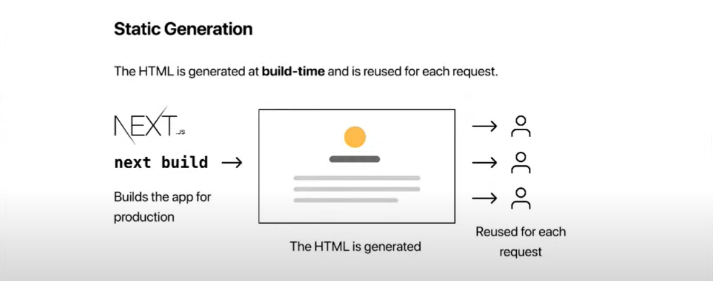
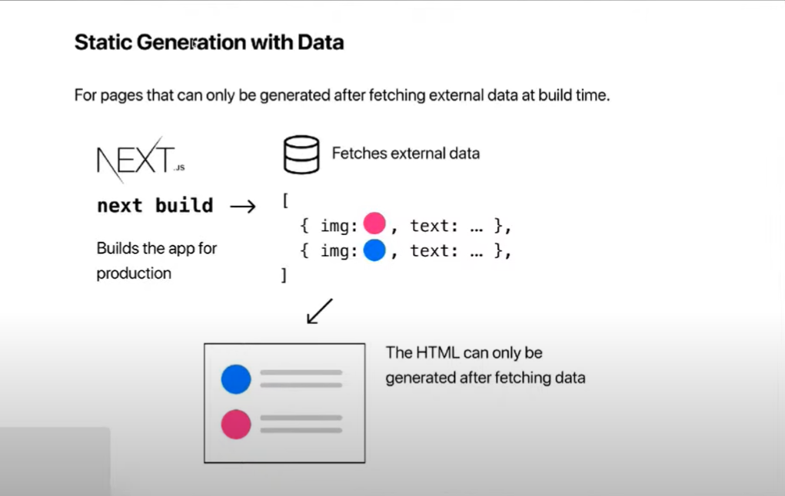

# My learnings from NextJs

## What is Next.js?

The docs define Next.js as **The React Framework for Production**.

But why a framework for react, isn't React enough to start building applications. Well

- React is a library for building user interfaces, it is responsible only the view layer of the application.

- Now if you think of building applications with just **React**. Its is not really possible to build to full feature rich application ready to be deployed for production just with it.

- As a developer you have to make decisions on how to implement different features like routing, styling, authentication, backend api etc.

Well Next.js on the other hand is framework(a complete solution with its own opinionated rules of building an app).

- A package that uses React for building user interfaces.

- Loaded with a lot more features that enable you to build full fledged production readu applications. Features exactly like routing, styling, authentication, bundle optimization, backend apis etc.

- As mentioned before, its has some opinions and conventions that needs to followed to implement the above said features.

## Why Next.js?

Next.js simplifies the process of building a react application for production by abstracting a lot of things.
Some of the features that Next.js provides-

- File based Routing.
- Pre-rendering.
- API routes.
- Support CSS modules.
- Authentication.
- Dev and Prod build system.

## Routing

Next js has an opiniated way of routing all the screens/pages, its called **File Based Routing**.

### Routing with Pages

- All the files( react component ) created in the pages folder corresponds to paths with similar names on the app.
- You can also just create a subfoler inside the pages folder and create an index.js file inside that folder, the react, a new route will me created with the same name as that of the subfolder and it will reside the react component(or page) you just created in that index.js file.
- _index.js_ always corresponds to root path of the directory/folder inside which it is present. For example index.js inside pages folder will correspont to domain root of the app( here <https://localhost:3000> ) and index.js inside subfolder projects will correspond to route <http://localhost:3000/projects>.

### Nested Routes

- To nest routes you can simply create different files inside the subfolders.
- For example if you want to create a route like this _/blog/first_ or _/blog/second_, the just create a subfolder named _blog_ and created _first.js_ and _second.js_ inside that folder, it will automatically correspond to the routes mentioned above.

### Dynamic Routes

- To make a route dynamic you can wrap the name of that file with square brackets.
- For example to make routes like _/project/1_ , _project/2_, _project/anything_ we can create a file [projectId].js inside the project subdirectory and all of these routes mentioned above will correspond to it.
- To access the parameter mentioned in the dynamic route you can make use of **_useRouter from "next/router"_**, and extract query property from it, which in itself is an object and contains all the dynamic parameter( here _productId_ )

### Nested Dynamic Routes

- To nested routes inside a dynamic routes, instead of file you can create a folder with the same name enclosed in [], and then create nested routes inside that folder.
- For example for routes like _/project/1/review_ _/project/200/review_, or _/project/2/review/3004_ you can create a subfolder [projectId] inside project folder and inside that subfolder create review folder and so on.
- Now to access all these dynamic parameters you still have use the _useRouter_ as metioned in the previous section.

### Catch all routes

- To make a catch all routes pages, your file name should be enclosed in square brackets and three dots should be preceeding it.
- For example to catch routes after _/docs_ like _/docs/abc_, _/docs/abc/aaaa/cedd_ you can create a file [...slug].js.
- And to make catch all routes optional you can add another square bracket around it. So, [[...slug]].js will catch _/docs_ , _/docs/anything/after/it_.

> Note: All the predefined rotues takes precedence over Dynamic routes, and all the Dynamic routes takes precedence over catch all routes.

### 404 Not Found

Next already provides a Not found page for any unmatched routes, but if you want to create a custom 404 not found page, you can do so by creating a file names **_404.js_** in the root directory( i.e pages ).

### Navigating

- We can use the **Link** component to navigate to any page.([more detailed explation](https://nextjs.org/docs/api-reference/next/link))
- Also we can use the router object which comes with methods like push, replace, back to navigate imperatively in the app.([router docs](https://nextjs.org/docs/api-reference/next/router), [example](https://nextjs.org/docs/routing/imperatively))

## Pre-Rendering

In a simple CRA( Create React App), you get an HTML page with `
`, which gets populated( or Hydrated) from the bundle.js file, when it runs on the browser. This is what you call Client Side Rendering(CSR).

In Next.js it pre-renders every page in the application by default.

### But what does pre-render mean?

Its means that Next.js generates HTML for each page in advance instead of getting it all done by the client-side javascript.

### Why Pre-rendering?

1. Pre-rendering imporves app performance.

   - In a react app you need to wait for the JavaScript to be excecuted.
   - Perhaps to fetch data from an external API and then render the UI.
   - There is an initial wait time for the user, which spoils the user-expreience.
   - With pre-rendered page, the HTML is already generated and loads faster.

2. Pre-rendering helps with SEO.
   - If you are building a blog or an e-commerce site SEO is a concern.
   - With React app, if the search engine hits you page, it only sees a div element with id as "root".
   - If the search engine hits a pre-rendered page though, all the content is present in the source code which will help index that page.

### Next.js supports two forms of Pre-rendering

- Static Site Generation (SSG)
- Server Side Rendering (SSR)

### Static Site Generation

- A method of pre-rendering where the HTML pages are generated at build time.
- The HTML with all the data that makes up the content of the ages are generated in advance ehwn you build you application.
- Recommended method to pre-render pages whenever possible.
- Page can be built once, cached by a CDN and served to the client almost instantly.
- Ex. Blog pages, Portfolio websites, e-commerce listing pages, documentation and marketing pages.

Static Generation can be done with or without fetching external data.

As of now what we have discussed is all part of SSG witout fetching external data. Lets go for the latter now.

### SSG with Data

Some pages require fetching external data for pre-rendering.
There are two scenarios, and one or both might apply. In each case, you can use these functions that Next.js provides:

- Your page content depends on external data: Use getStaticProps.
  - To fetch this data on pre-render, Next.js allows you to export an async function called getStaticProps from the same file. This function gets called at build time and lets you pass fetched data to the page's props on pre-render.( [more detailed explaination](https://nextjs.org/docs/basic-features/data-fetching#getstaticprops-static-generation) )
- Your page paths depend on external data: Use getStaticPaths (usually in addition to getStaticProps).

**getStaticProps** :

- A

  - _getStaticProps_ runs only on the server side.
  - The function will never run on the client-side.
  - The code you wrote inside _getStaticProps_ won't even be included in the JS bundle thai is sent to the browser.

- B

  - You can write server-side code directly in _getStaticProps_.
  - Accessing the file system using the fs module or querying a database can be done inside _getStaticProps_.
  - You don't have to worry about including API keys in _getStaticProps_ as that won't make it to the browser.

- C

  - _getStaticProps_ is allowed only in page and cannot be run from a regular component file.
  - Its used only for pre-rendering and not client-side datafetching.

- D

  - _getStatcProps_ should return an object and object should contain a props property which in turn should be an object.

- E
  - _getStaticProps_ will run at build time.
  - During development, _getStaticProps_ runs on every request(reload of the page).

**Link Pre-Fetching**:

- When a page with getStaticProps is pre-rendered at build time, in additon to page HTML file, Next.js generates a JSON file holding the result of running getStaticProps.

- The JSON file will be used in client-side routing through next/link, or next/router.

- When you navigate to a page that's pre-rendered using getStaticProps, Next.js fetches the JSON file( pre-computed at build time ) and uses it as the props to create the page component client-side.

- Client-Side page transitions will not call getStaticProps as only the exported JSON is used.

**_Summary so far_**

- Static Generation is a method of pre-rendering where the HTML is generated at the build time.
- With and without external data.
- Export getStaticProps function for external data.
- HTML, JavaScript and a JSON file are generated.
- If you navigate directly to the page route, the HTML file is served.
- If you navigate to the page route from a different route, the page is created client side using the JavaScript and JSON pre-fetched from the server.
